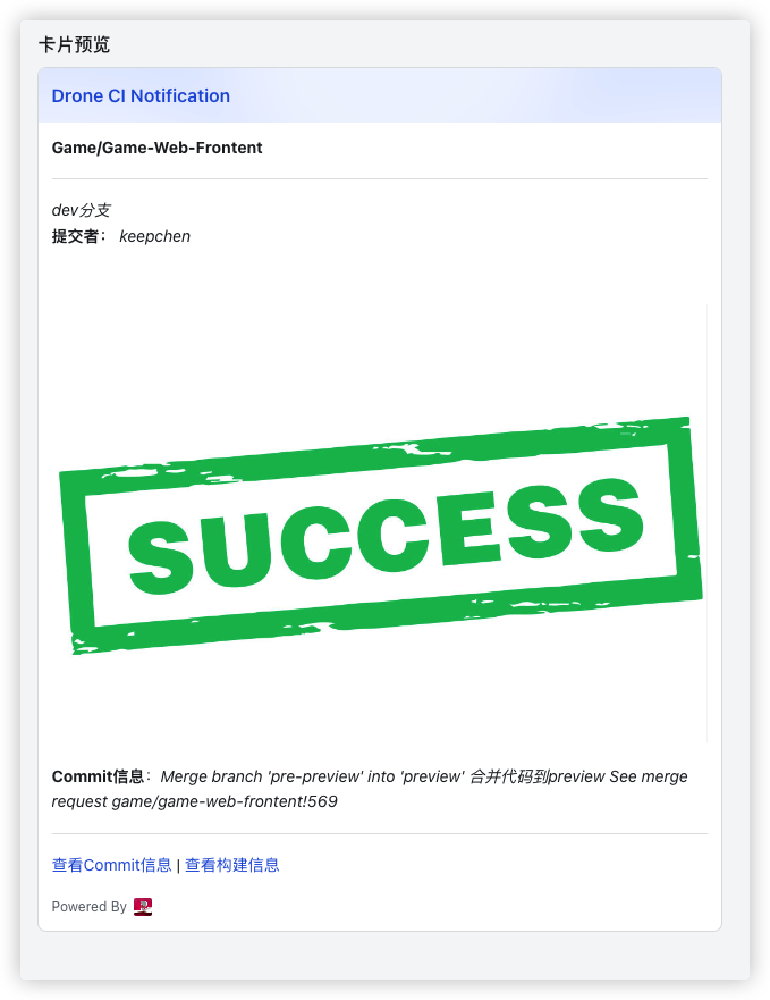
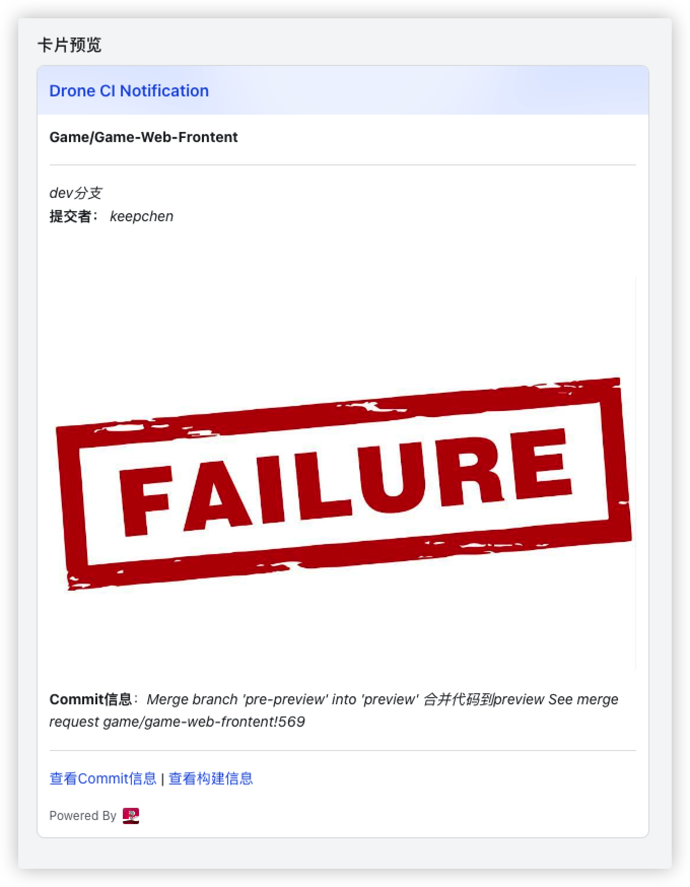
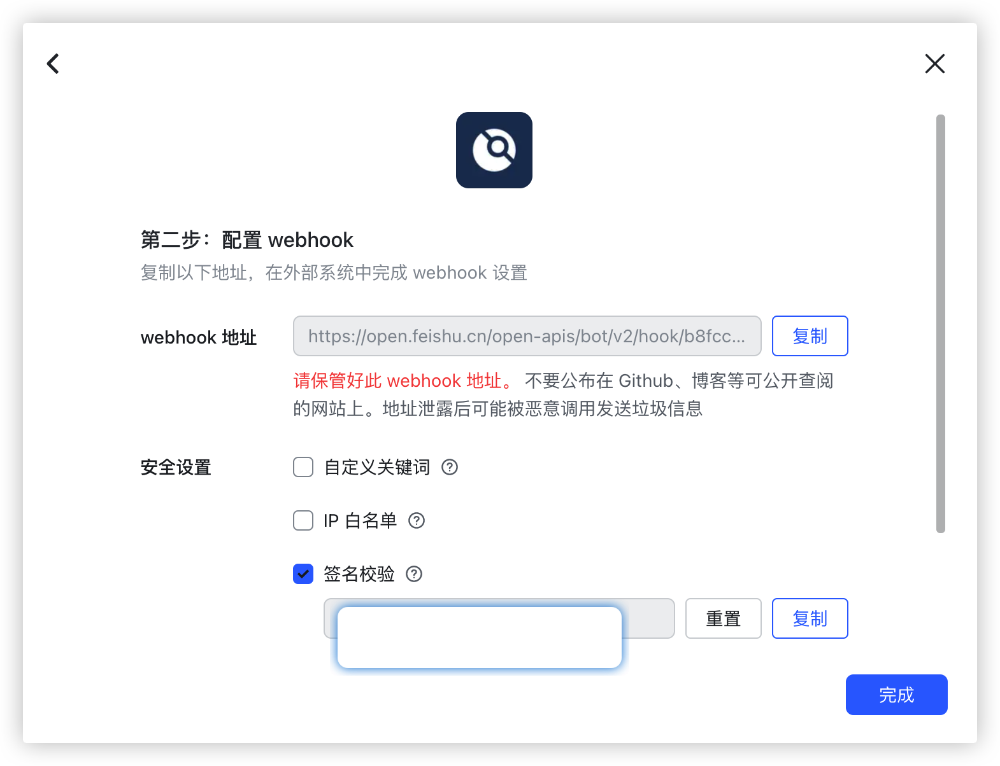

# drone-feishu
feishu robot notification for drone ci plugin  

> inspired [guoxudongdocker/drone-dingtalk](https://hub.docker.com/r/guoxudongdocker/drone-dingtalk)

#### screenshot  

- success

  

- failure  

  

#### Test  

> According to your actual situation, set the environment variables in this run_test.sh file, and then run it.

#### Pipeline Settings (.drone.yml)  
```yaml
- name: feishu notification
  image: keepchen/drone-feishu 
  settings:
    token: 
      from_secret: feishu_token
    secret:
      from_secret: feishu_secret
    card_title: ""
    success_img_key: ""
    failure_img_key: ""
    powered_by_img_key: ""
    powered_by_img_alt: ""
  commands:
    - env
  when:
    status: [failure, success]
```  
- how to get my pictures `img_key`?  
see [doc](https://open.feishu.cn/document/ukTMukTMukTM/uUjNwUjL1YDM14SN2ATN)  
- what's the `token` & `secret`?  
  

#### Environment  
| variable | value | desc |
| ---- | ----| ---- |
| PLUGIN_TOKEN | xxxxxx-xxx-xxxx-xxxx-xxxxxxxxxxxx | 飞书的webhook token值 |
| PLUGIN_SECRET | xxxxxxxxxx | 飞书的签名校验secret |
| PLUGIN_CARD_TITLE | | 卡片消息标题 |
| PLUGIN_SUCCESS_IMG_KEY | | 构建成功图片 |
| PLUGIN_FAILURE_IMG_KEY | | 构建失败图片 |
| PLUGIN_POWERED_BY_IMG_KEY | | 版权logo |
| PLUGIN_POWERED_BY_IMG_ALT | | 版权logo的alt提示文字 |  

#### Finally  
Enjoy it. :)
